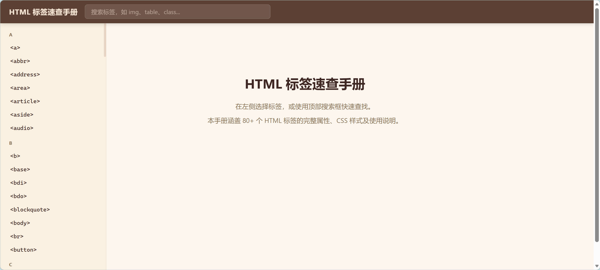
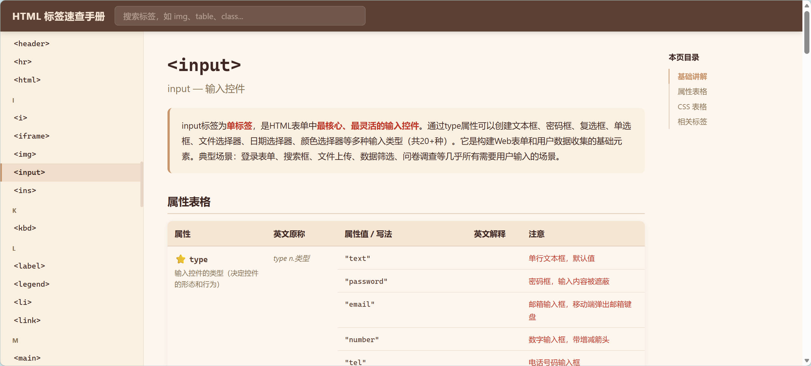

# HTML 标签速查手册



一个轻量、美观的 HTML 标签速查工具，覆盖 **80+ 个 HTML 标签**的完整属性、CSS 样式及使用说明，支持快速搜索与目录导航，适合前端开发者日常查阅。

---

## 项目简介

在日常前端开发中，我们经常需要快速确认某个 HTML 标签有哪些属性、某个属性接受什么值、以及对应的 CSS 样式该如何编写。与其在搜索引擎和 MDN 之间反复跳转，不如在一个页面内一站式解决。

本手册以 **`<input>` 标签为起点**，为每个标签整理了：

- **功能与应用场景**：一句话说清标签是干什么的
- **完整属性表格**：属性名、英文原称、可选值、注意事项——每一项都配有简短的中文说明
- **CSS 样式表格**：与该标签相关的 CSS 属性、推荐写法、实用备注
- **相关标签推荐**：一键跳转到关联标签的详情页

---

## 设计细节

### 配色方案

整体采用**暖棕色系 + 奶油底色**，模拟纸张阅读的温润质感，降低长时间查阅的视觉疲劳。

| 用途 | 色值 | 说明 |
|------|------|------|
| 主题棕 | `#5C4033` | 顶部导航栏背景 |
| 奶油底 | `#FDF6EE` | 页面主背景 |
| 暖橙 | `#C8956C` | 强调色、链接、高亮 |
| 米白侧栏 | `#FAF0E1` | 左侧标签列表面板 |
| 点缀红 | `#C0392B` | 重点标记与注意事项 |

### 顶部搜索栏

位于固定顶栏右侧，支持以下搜索方式：

- **标签名精确匹配** — 输入 `table` 直接跳转
- **英文名模糊匹配** — 输入 `image` 匹配到 ``
- **中文描述匹配** — 输入「表格」找到 `<table>`
- **全局属性关键词** — 输入 `id`、`class`、`style` 等跳转到全局属性页

输入时实时预览匹配结果，按 Enter 跳转。

### 左侧标签导航

- 标签按首字母 A-Z 分组，折叠式排列
- 标签名使用等宽字体（Cascadia Code / Fira Code），贴近代码编辑器的视觉习惯
- 当前选中的标签以暖橙色左边框 + 浅色背景高亮
- 底部设有「全局属性」快捷入口
- 移动端通过汉堡菜单展开，带遮罩层，点击遮罩或按 Esc 关闭

### 右侧定位目录



参照 MDN 的右侧导航设计，每个标签页面右侧自动生成**粘性定位的章节目录**，包含四个固定章节：

- **基础讲解** — 标签的功能说明与使用场景
- **属性表格** — 全部属性一览
- **CSS 表格** — 推荐样式与常用取值
- **相关标签** — 关联标签快速跳转

点击目录项平滑滚动到对应章节，页面滚动时自动高亮当前所在章节。目录在窄屏（≤1100px）下自动隐藏，不给小屏幕添乱。

### 响应式适配

- **桌面端（>1100px）**：左侧标签栏 + 中间内容区 + 右侧目录，三栏布局
- **中等屏幕（768px–1100px）**：隐藏右侧目录，保留左侧标签栏 + 内容区
- **移动端（≤768px）**：左侧标签栏收起为汉堡菜单，内容区占满全宽，表格横向滚动

---

## 使用流程

假设你正在开发一个登录页面，需要确认 `<input>` 标签的 `autocomplete` 属性有哪些可选值：

1. 打开页面，在**顶部搜索栏**输入 `input`，回车
2. 页面跳转到 `<input>` 标签的详细讲解页
3. 点击**右侧目录**的「属性表格」，页面平滑滚动到属性表
4. 在属性表中找到 `⭐ autocomplete` 行，看到它的四个可选值：`on`、`off`、`new-password`、`current-password`
5. 选择 `current-password` 用于登录密码框的自动填充

整个过程无需离开页面、无需打开新标签页，全程在一个页面内完成查阅与跳转。

---

## 产品结构

```
HTML-tags/
├── index.html              # 主页面入口
├── css/
│   └── style.css           # 全局样式（配色、布局、表格、响应式）
├── js/
│   ├── main.js             # 路由控制、数据加载、全局属性页渲染
│   ├── render.js           # 标签详情页渲染、右侧目录生成
│   ├── search.js           # 搜索匹配与提示逻辑
│   └── sidebar.js          # 左侧标签导航、汉堡菜单交互
├── data/
│   ├── html-tags.json      # 80+ 标签的结构化数据
│   └── global-attributes.json  # HTML 全局属性数据
├── build_tags_hm.py        # 数据构建脚本
├── screenshots/
│   ├── 主页展示.jpg
│   └── input页面截图.jpg
└── README.md
```

---

## 技术栈

- **纯 HTML / CSS / JavaScript**，零依赖，开箱即用
- 数据驱动：标签内容与结构分离，JSON 数据源驱动渲染
- 路由基于 `hashchange`，支持浏览器前进/后退
- IntersectionObserver 驱动右侧目录高亮

---

## 本地运行

```bash
# 克隆仓库
git clone https://github.com/Cori-anba/HTML-tags.git

# 直接用浏览器打开 index.html，或使用任意静态服务器
cd HTML-tags
npx serve .        # 或 python -m http.server 8080
```
